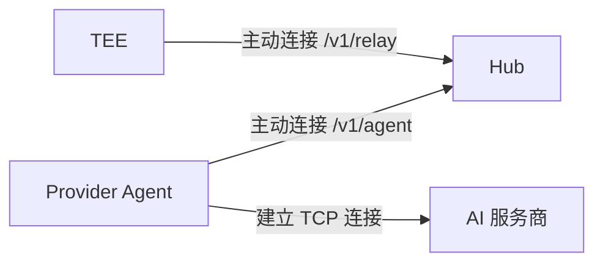
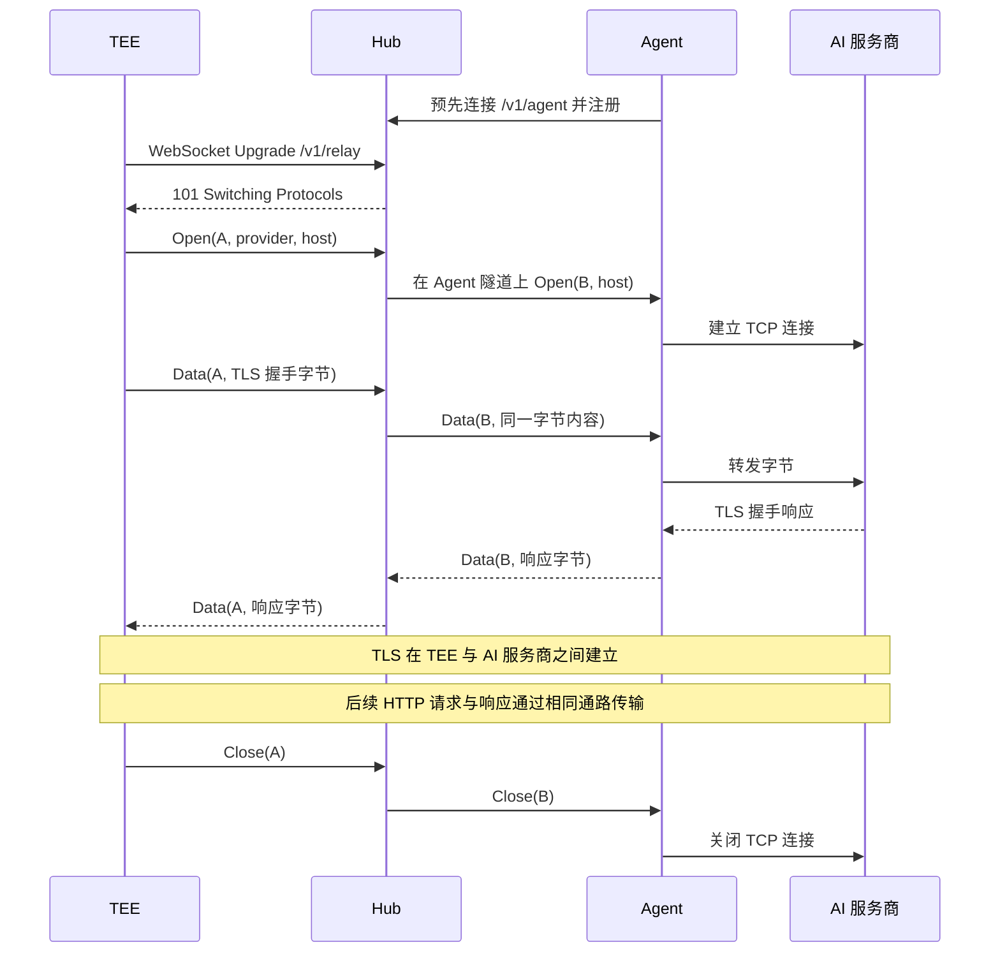

# TokenHive TEE 与 Hub 的 Relay WebSocket 协议

本文面向需要在自己的服务中实现 Relay 服务端、与 TokenHive TEE 对接的开发者。

实现基准：[PR #2](https://github.com/openweb3/reclaim-tee/pull/2)，提交 `0b23c71d60614830da1ef2532c8e67de164b7684`。本文描述该版本的线上格式和行为，不表示当前检出分支已包含对应实现。

## 1. Relay 的作用与边界

Relay 为 TEE 提供到 AI 服务商的双向网络通路。Provider Agent 主动连接 Hub，TEE 也主动连接 Hub，由 Hub 把两边桥接起来，因此 Agent 位于 NAT 后也能提供网络出口。



图中箭头表示建连方向。连接建立后，数据沿 `TEE <-> Hub <-> Agent <-> AI 服务商` 双向传输。

| 通道 | 连接方向 | 用途 |
|---|---|---|
| `/v1/relay` | TEE 连接 Hub | 上游网络中继，本文描述的多路复用协议 |
| `/v1/execute` | Hub 请求 TEE | HTTP 提交 JobSpec 和正文，SSE 返回响应与回执 |
| `/v1/session` | Hub 连接 TEE | 另一套 WebSocket 会话协议，使用 CBOR 请求、二进制数据与 JSON 控制消息 |
| `/v1/agent` | Agent 连接 Hub | Agent 注册及接收 Hub 打开的上游中继流 |

Relay 不传 JobSpec、凭据信封或执行回执。它的 Open 消息提供路由信息，Data 消息承载原始字节。正常 HTTPS 路径中，TLS 客户端和会话密钥在 TEE 内，上游 TLS 服务端在 AI 服务商；Hub 与 Agent 转发 TLS 流量，不负责解密。

Hub 能看到 Provider、目标地址、流量大小和时序。该隔离描述仅针对 Relay 通道，Hub 在任务接口上仍可能持有请求正文并接收业务响应。

## 2. 建立 WebSocket 连接

本阶段按内网通信、不启用 mTLS 对接，TEE 配置的地址例如：

```text
ws://<hub-private-address>:<port>/v1/relay
```

TEE 发起标准 WebSocket Upgrade，Hub 返回 `101 Switching Protocols` 后，双方直接交换隧道帧。该实现没有额外的欢迎消息、JSON 登录消息、子协议协商或协议版本字段。

PR 中 Relay 客户端不发送专用鉴权头，Hub 的 `TeeRelay` 处理器也没有内置身份检查。`/v1/agent` 的共享密钥校验不适用于 `/v1/relay`。如以后增加鉴权，应在双方的握手处理上单独接入，不能假定当前已支持 Bearer token。

TEE 在首次需要上游连接时建立 Relay WebSocket，并复用它打开后续逻辑流。一条 WebSocket 对应一个多路复用器。

## 3. 二进制帧格式

发送端使用 WebSocket Binary 消息承载隧道字节。每个隧道帧由固定的 13 字节头和变长载荷组成：

| 字段 | 起始偏移 | 字节数 | 编码与含义 |
|---|---:|---:|---|
| Kind | 0 | 1 | `1 = Open`，`2 = Data`，`3 = Close` |
| Stream ID | 1 | 8 | 无符号 64 位整数，大端序 |
| Payload Length | 9 | 4 | 无符号 32 位整数，大端序，只计算载荷长度 |
| Payload | 13 | N | 载荷内容取决于 Kind |

```text
| Kind: 1 | Stream ID: 8 | Payload Length: 4 | Payload: N |
```

单帧 Payload 最大为 `1 << 20`，即 1 MiB。接收端先检查长度，再分配载荷缓冲；当前实现遇到超限帧会终止整个多路复用器。

WebSocket 单消息接收上限为 `1 MiB + 1 KiB`，即 1,049,600 字节。发送端即使合并多个隧道帧，也不能突破这个单消息限制。

### 3.1 WebSocket 消息与隧道帧的边界

**一个 WebSocket 消息不等于一个隧道帧。** 当前 Go 发送端分别写入帧头和载荷，可能形成两个 Binary 消息：

```text
WebSocket Binary 消息 1: [13 字节帧头]
WebSocket Binary 消息 2: [N 字节载荷]
```

接收端必须按顺序拼接消息载荷，再按隧道帧格式解析。既要支持一个隧道帧跨消息，也要支持一个消息中存在多个完整帧或帧的一部分。外层 WebSocket 消息分片由 WebSocket 库处理。

兼容发送端应发送 Binary 消息；Text JSON 不是本协议的控制消息。外层 ping/pong 不携带隧道业务数据。

## 4. Stream ID 与多路复用

Stream ID 标识一条逻辑上的双向字节流。接收方为每条 WebSocket 维护：

```text
Stream ID -> 逻辑流、接收缓冲、关闭状态、关联的上游通路
```

一条逻辑流对应一条上游连接，不必对应一个业务请求。普通 HTTP 连接可由 TEE 连接池顺序复用，多个并发请求需要多条连接；双向长会话独占其连接。

| 端点角色 | 分配区间 | 在 TEE-Hub Relay 上的角色 |
|---|---|---|
| High | `[2^63, 2^64)` | TEE |
| Low | `[0, 2^63)` | Hub |

当前 TEE 的第一条流 ID 为 `9223372036854775808`，十六进制为 `0x8000000000000000`，后续递增。同一流的两个通信方向使用相同 ID，Hub 返回 Data 和 Close 时沿用 TEE 发来的 ID，不重新分配。

区间划分是通用多路复用器的约定。当前 Relay 由 TEE 开流，TEE 没有安装接收反向 Open 的处理器，Hub 不应主动在这条连接上新开业务流。

ID 只在所属 WebSocket 内有意义。多条 TEE 连接可以使用相同数字 ID；Hub 的映射必须属于各自的连接，或以 `(WebSocket 连接, Stream ID)` 为键。新连接不能凭旧 ID 恢复旧流。

JavaScript/TypeScript 必须用 `BigInt` 或等价的 64 位整数表示，不能用 `Number`，否则从第一条 TEE 流开始就可能丢失精度。

```text
Open(A)
Open(B)
Data(A, ...)
Data(B, ...)
Data(A, ...)
Close(B)
Data(A, ...)
```

不同流的帧可以交错，但每条流内部的字节顺序必须保持。发送端需要串行写出完整隧道帧，避免并发发送造成帧头与其他流载荷混合。

## 5. Open、Data 与 Close

### 5.1 Open: 创建上游通路

`Kind = 1`，Payload 为 UTF-8 JSON，例如：

```json
{"provider":"provider-a","host":"api.openai.com:443"}
```

| 字段 | 类型 | 含义 |
|---|---|---|
| `provider` | string | 用于查找在线 Agent 的 Provider 标识 |
| `host` | string | 目标 `host:port`，不含 URL scheme、路径或查询参数 |

Hub 解析后查找该 Provider 的 Agent，在 Agent 隧道中打开另一条流，传入 `{"host":"api.openai.com:443"}`，并将两条流桥接。Agent 检查目标允许列表，再建立到目标的 TCP 连接。

TEE-Hub 流与 Hub-Agent 流有各自的 ID。Hub 应保存两条流的对应关系，而不是原样转发包含 TEE 流 ID 的整个隧道帧。

Open 元数据应放在单个隧道帧内。协议没有 Open 元数据分片重组机制，不能像 Data 一样拆分一个 JSON 后分成多次 Open。

**当前没有 OpenAck。** TEE 写出 Open 后即可发送数据；Hub 应允许这些数据在上游建连期间暂存，而不能要求 TEE 等待一个未定义的确认消息。

如果 JSON 无法解析、没有在线 Agent 或无法打开通路，当前服务端通过关闭该流表示失败，不返回结构化错误码。`Relay.Dial()` 返回不代表上游 TCP/TLS 已建连成功。

### 5.2 Data: 双向传输原始字节

`Kind = 2`，Payload 为属于指定 Stream ID 的原始字节，无额外 JSON、CBOR 或 Base64 包装。

TEE 将 Relay Stream 包装成 `net.Conn`，然后在其上执行 TLS 握手。Hub 把 TEE 发来的 Data 载荷交给关联 Agent 流，并把 Agent 返回的数据封装为对应 Stream ID 的 Data 发回 TEE。

一次大于 1 MiB 的数据写入应拆成多个 Data 帧。TLS record、HTTP 请求和响应均可能跨越多个 Data 帧，接收方只需保持字节顺序，不应依赖帧边界解析业务消息。

### 5.3 Close: 关闭整条逻辑流

`Kind = 3`，当前发送实现使用零长度 Payload。接收端不解析关闭原因载荷；没有约定的错误码字段。

任一端都可以发送 Close，表示整条逻辑流结束。当前没有半关闭或 CloseAck：不能表达“我不再发送，但继续接收”。已经缓冲的数据仍可被本地读完，之后读取返回 EOF。

Hub 关闭关联上游流并清理映射。桥接任一方向结束时，当前 `Bridge` 实现会关闭两端；仅关闭一条流不应主动关闭仍有其他流使用的 WebSocket。

## 6. 一次完整通信



图中 A、B 是两段隧道中的流标识，实际线上均为 uint64。凭据由 TEE 注入 TLS 内的 HTTP 请求，不会出现在 Open 元数据中。请求完成后，TEE 可保留健康连接供后续任务使用，因此不要求每个请求结束都发送 Close。

## 7. 解析循环与异常行为

服务端接收逻辑可以按以下步骤实现：

1. 将收到的 WebSocket 消息载荷顺序接入字节缓冲。
2. 累积到至少 13 字节后，读取 Kind、Stream ID 和 Payload Length。
3. 检查载荷上限，等待足够的 Payload 字节，再取出完整帧。
4. Open 创建流并异步准备上游，Data 按 ID 分发，Close 结束流。
5. 继续解析缓冲中的剩余帧。多个流共用一个发送器，保证帧写入不交错。

以下是基准实现的兼容行为，不应据此发送非法流量：

| 情况 | 当前行为 |
|---|---|
| 未知 Kind | 读取其载荷后忽略 |
| 已存在 ID 的重复 Open | 忽略重复 Open，保留原流 |
| 不存在的 ID 收到 Data 或 Close | 忽略 |
| Open 到达但未配置 Open 处理器 | 发送 Close |
| 载荷长度超过 1 MiB | 终止多路复用器，结束其上的流 |
| 读写失败或底层 WebSocket 断开 | 活跃流结束，不支持断点续传 |

没有流级序列号、重传或恢复 token；传输顺序依赖 WebSocket/TCP。TEE 客户端在开流错误路径中安排一次重建重试，但这不是协议 ACK 或交付保证，也不会恢复已中断的 TLS 会话或保证已发送业务请求可安全重放。

## 8. 当前实现限制

这些限制属于当前 Go 实现，不是必须照搬的服务端架构：

- 每流接收缓冲使用约 8 MiB 的背压阈值，不是整个连接的总内存上限。达到阈值后，共享读取循环会等待该流被消费，因此慢流可能阻塞其他流。
- 没有协议级的流量窗口更新消息、最大并发流协商或流级 deadline 字段。
- TEE 侧 `streamConn.SetDeadline`、`SetReadDeadline` 和 `SetWriteDeadline` 当前为空实现。Relay 建连超时默认 10 秒，但不能据此认为每条流的后续读写都有同等超时保证。
- 逻辑流和多路复用器的关闭状态不等于底层 socket 已被释放；集成服务必须明确 WebSocket 连接及上游资源的清理责任。

## 9. 实现位置

下列链接固定到本文的基准提交，避免与其他分支的接口混淆：

| 文件 | 作用 |
|---|---|
| [transport/relay.go](https://github.com/openweb3/reclaim-tee/blob/0b23c71d60614830da1ef2532c8e67de164b7684/tokenhive/transport/relay.go) | TEE 连接 Hub、发送 Open、包装为 net.Conn |
| [tunnel/tunnel.go](https://github.com/openweb3/reclaim-tee/blob/0b23c71d60614830da1ef2532c8e67de164b7684/tokenhive/tunnel/tunnel.go) | 帧格式、Stream ID、读写分发、缓冲及关闭 |
| [tunnel/ws.go](https://github.com/openweb3/reclaim-tee/blob/0b23c71d60614830da1ef2532c8e67de164b7684/tokenhive/tunnel/ws.go) | WebSocket 与连续字节流的适配 |
| [hub/agenthttp.go](https://github.com/openweb3/reclaim-tee/blob/0b23c71d60614830da1ef2532c8e67de164b7684/tokenhive/hub/agenthttp.go) | TeeRelay 服务端和流桥接 |
| [hub/agentnet.go](https://github.com/openweb3/reclaim-tee/blob/0b23c71d60614830da1ef2532c8e67de164b7684/tokenhive/hub/agentnet.go) | RelayOpen、UpstreamOpen 和 Agent 注册表 |
| [provider/agent.go](https://github.com/openweb3/reclaim-tee/blob/0b23c71d60614830da1ef2532c8e67de164b7684/tokenhive/provider/agent.go) | Agent 检查目标并建立上游 TCP 通路 |
| [transport/channel.go](https://github.com/openweb3/reclaim-tee/blob/0b23c71d60614830da1ef2532c8e67de164b7684/tokenhive/transport/channel.go) | TEE 在 Relay 流上建立 TLS，管理连接复用 |

Go 服务可以复用 `tunnel` 包完成协议解析和多路复用；自己的 Hub 主要实现按 Provider 路由、打开对应 Agent 流、双向桥接及资源清理。
